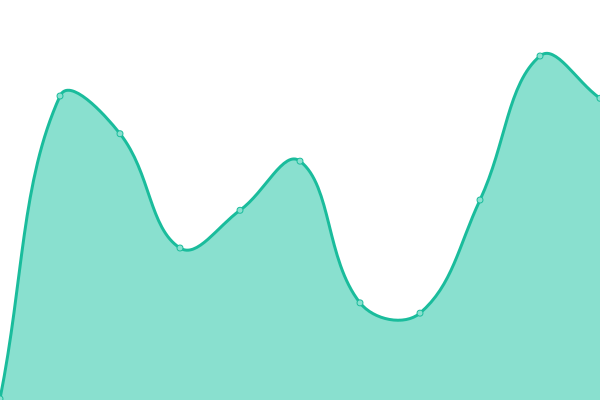
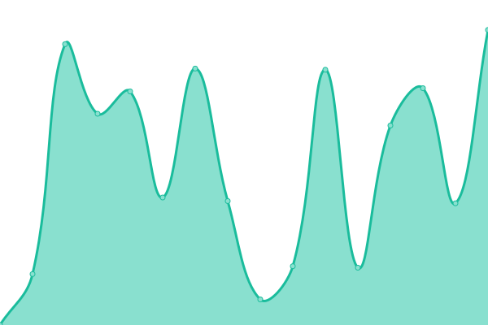

# [📈 Live Status](https://devtomatocake.github.io/Status): <!--live status--> **Alle Systeme sind erreichbar**

This repository contains the open-source uptime monitor and status page for [TomatoCake](https://vanillaminigames.eu/), powered by [Upptime](https://github.com/upptime/upptime).

With [Upptime](https://upptime.js.org), you can get your own unlimited and free uptime monitor and status page, powered entirely by a GitHub repository. We use [Issues](https://github.com/devtomatocake/Status/issues) as incident reports, [Actions](https://github.com/devtomatocake/Status/actions) as uptime monitors, and [Pages](https://devtomatocake.github.io/Status) for the status page.

<!--start: status pages-->
<!-- This summary is generated by Upptime (https://github.com/upptime/upptime) -->
<!-- Do not edit this manually, your changes will be overwritten -->
<!-- prettier-ignore -->
| URL | Status | History | Response Time | Uptime |
| --- | ------ | ------- | ------------- | ------ |
|  [Vanilla Minigames Website](https://vanillaminigames.eu) | Up | [vanilla-minigames-website.yml](https://github.com/DEVTomatoCake/Status/commits/HEAD/history/vanilla-minigames-website.yml) | 

 126ms
     
 | 

<a href="https://status.vanillaminigames.eu/history/vanilla-minigames-website">100.00%</a>
    

|  [Tomatenkuchen Website](https://tomatenkuchen.eu) | Up | [tomatenkuchen-website.yml](https://github.com/DEVTomatoCake/Status/commits/HEAD/history/tomatenkuchen-website.yml) | 

 166ms
     
 | 

<a href="https://status.vanillaminigames.eu/history/tomatenkuchen-website">100.00%</a>
    

|  [chaoshosting Webinterface](https://panel.chaosbothosting.de) | Up | [chaoshosting-webinterface.yml](https://github.com/DEVTomatoCake/Status/commits/HEAD/history/chaoshosting-webinterface.yml) | 

 667ms
     
 | 

<a href="https://status.vanillaminigames.eu/history/chaoshosting-webinterface">100.00%</a>
    

|  [Node2 und/oder Tomatenkuchen](https://node2.chaoshosting.tk:25508) | Up | [node2-und-oder-tomatenkuchen.yml](https://github.com/DEVTomatoCake/Status/commits/HEAD/history/node2-und-oder-tomatenkuchen.yml) | 

 726ms
     
 | 

<a href="https://status.vanillaminigames.eu/history/node2-und-oder-tomatenkuchen">99.82%</a>
    

<!--end: status pages-->

[**Visit our status website →**](https://devtomatocake.github.io/Status)

## 📄 License

- Powered by: [Upptime](https://github.com/upptime/upptime)
- Code: [MIT](./LICENSE) © [TomatoCake](https://vanillaminigames.eu/)
- Data in the `./history` directory: [Open Database License](https://opendatacommons.org/licenses/odbl/1-0/)
